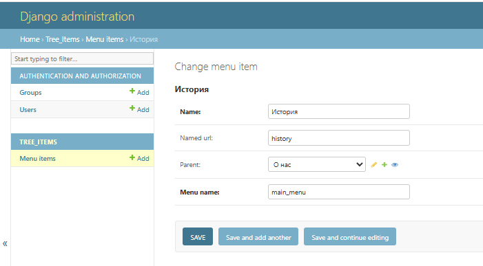
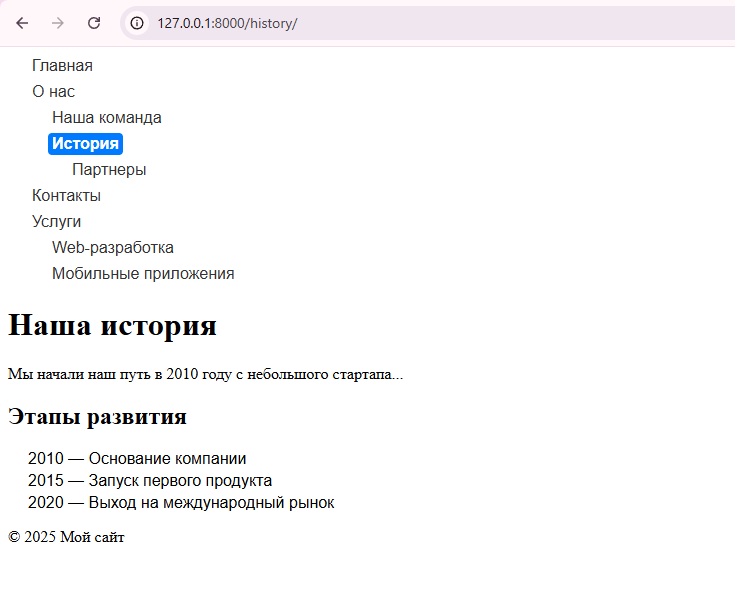

# Tree menu

Этот проект на Django реализует древовидное меню с возможностью редактирования через админку. Меню сохраняется в базе данных и отображается на страницах сайта с использованием пользовательского тега шаблона ``.


## Функции
Меню поддерживает:

- Несколько независимых меню (по имени `menu_name`)
- Активный пункт и раскрытие дерева
- Генерацию URL по `named_url` или прямому пути
- Отрисовку через template tag ``
- Всего 1 запрос к БД на отрисовку меню

## Установка

```bash
git clone https://github.com/belyashnikovatn/tree_menu
cd tree_menu
python -m venv venv
source venv/bin/activate  # Windows: venv\Scripts\activate
pip install -r requirements.txt
python manage.py migrate
python manage.py bootstrap_site
python manage.py runserver
```

## Предварительное заполнение данными 
Проект поставляется с фикстурой fixtures/initial_menu.json, которая заполняет базу данных примером меню. Также предусмотрено автоматическое создание админа. Всё это реализовано с помощью команды bootstrap_site.


## Работа с админкой
Перейдите в админку Django по адресу http://127.0.0.1:8000/admin/. Введите логин и пароль: 
- admin
- admin123

В разделе "Меню" вы можете добавить или отредактировать элементы меню.  
Каждый элемент меню имеет следующие поля:
- name — название пункта меню.
- named_url — именованный URL, например, для страницы "О нас" можно использовать about.
- parent — родительский элемент меню (для вложенных пунктов).
- menu_name — имя меню (например, main_menu).  




## Как работает меню:
Меню отображается на страницах с помощью шаблонного тега , где main_menu — это имя меню, которое будет отображаться.

## Пример использования в шаблоне:
```html

<!-- Отображаем меню с именем 'main_menu' -->

Меню будет отображаться на странице в виде списка, где активный пункт будет подсвечен на основе текущего URL.
```  


## Как добавить новые страницы
Чтобы добавить новую страницу, просто создайте новый URL-маршрут и соответствующий шаблон. Например, для страницы "Services" выполните следующие шаги:

### Добавьте новый путь в urls.py:

```python
path('services/', views.generic_view, {'template_name': 'services'}, name='services'),
```

### Создайте новый шаблон services.html в папке templates/:

```html
<!DOCTYPE html>
<html lang="ru">
<head>
    <meta charset="UTF-8">
    <title>Услуги</title>
</head>
<body>
    <h1>Услуги</h1>
    <p>Описание услуг компании.</p>
</body>
</html>
```

Теперь новая страница доступна по URL http://127.0.0.1:8000/services/.
